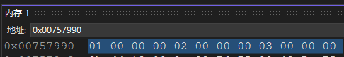

# 正确理解虚函数和虚表: 从命名空间到继承

笔者在初学C++时, 和大部分人一样, 对于命名空间 类继承 虚函数之类的概念感到疑惑, 今天我想从类声明时的保留关键字`public`和 `private` 讲起

在讲上述两个关键字之前, 我想先说一下下面的例子

```
int foo(){
return -1;
}
int main(){
return 0
}
```

如果关掉所有优化, 编译上面的代码, 我们在结果文件里面逆向工程, 是能找到foo函数的入口点的, 只不过这个函数没有任何调用方

类似的:

```

#include<iostream>
class test
{
private:
    int foo(){
        return -1
    }
public:
    test(/* args */);
    ~test();
};

test::test(/* args */)
{
}

test::~test()
{
}

```

private这里有一个foo函数, 没有任何调用者

但是这个函数仍然会编译, 并且有一个函数入口点

我们可以称其为`test::foo`

但是这个public和private仅仅是君子协定, 如果你暴露一个函数指针到用户输入, 你是可以成功执行foo函数的, 换句话来说, private是编译时的约定, 而非运行时的安全性保护技术


讲完这点之后, 我想再多一句, 我们来复习一下static关键字

在类中 被static关键字标记后, 编译时就会静态确定一个地址, 这个地址一般位于bss或者data段

当编译器发现你现在操作的数据是一个被static关键字声明的变量的时候, 他就不会像其他变量那样, 用this指针+offset的方式获得偏移,然后解引用

而是类似于#define 直接带换成static 的地址, 这个地址与class的实例无关, 也和this 指针无关,这里有个例子

.png>)

 (2).png>)

可以在反编译的IDA页面里看到, cout接收的地址参数是一个常量, 这个常量不是通过this指针确定的(this指针是运行时通过new分配出来的) 这个常量是在编译时直接带换确定出来的

&#x20;

复习完static之后我们就可以开始讲虚表了

这里小小吐槽一句, 笔者发现市面上许多C++初学者书籍,在讲解class 时 一般都是先讲解static关键字 后讲解虚类继承, 但是在讲解后者的时候全然不提他和前者的关系, 不过这也可以理解,  因为真正需要理解二者的细节和关系的话, 需要一些简单的汇编基础, 但是大部分初学者是先学习高级语言, 并没有汇编基础

好, 回到正题, 首先是解答一个疑问, 为什么说virtual关键字和static关键字有一定关系呢?

我们来看一个例子,

 (2).png>)

我们注意到, 每个Cat类实例都有一个\_vfptr指针,这个指针指向虚表

而虚表的结构是编译时确定的, 他被存放在一个特定的地址, 一般在rdata段,&#x20;

\_vfptr指针这个指针的值是一样的, 他有点类似于static, 唯一不同的是, 真正的static变量放在静态外存中, 然后加载进内存, 而虚表指针会在运行时, 由构造函数读取 虚表的位置, 然后把虚表指针填入构造函数新生成实例的0偏移位置

总结一下:

虚表的内容是编译时静态确定的, 根据类之间的继承关系(这点我们后面还会讲,先不用急), 便可以计算出他们之间的重写和继承关系, 然后填写一张虚表, 静态存储到PE文件的rdata段, 后续会被装载器映射到一个内存地址, 我们假定开启了固定机制 关闭alsr, 所以这个虚表在内存中的地址也是固定的

构造函数会在每次构造实例时, 把虚表被载入的地址找到(没开随机化的时候, 这个值是常数, 开随机化的情况下会通过一些手段找到, 具体方式请参阅, 程序员自我修养一书, 装载器和链接器相关章节), 然后填入新构造实例的0偏移位置

这个\_vfptr指针是一个指向结构体的指针, 结构体的内容是函数指针

图示如下(图源[https://leehao.me/C-%E8%99%9A%E5%87%BD%E6%95%B0%E8%A1%A8%E5%89%96%E6%9E%90/](https://leehao.me/C-%E8%99%9A%E5%87%BD%E6%95%B0%E8%A1%A8%E5%89%96%E6%9E%90/))

.png>)

可以看到\_vfptr指针在不同实例中,都处于相同位置, 值也相同

这本质上就是一个引用

也就是说, 复制和创建类对象的行为, 并不会新增类的方法, 同理也不能新增虚方法, 所以这个虚表指针采用了类似static的行为方式, 这也就是为什么我们前面提到了静态关键字

那么, 为什么虚方法非要用一个结构体存起来函数入口呢? 非虚函数不就是直接编译好了, 调用的时候直接去找函数入口, 这样不就可以了吗?

问题的关键在于, 类型为`基类指针的变量`是可以绑定到类型为`子类指针的地址`上的

毕竟, 指针就是一个地址, 仅仅是一个地址, 一个数字, 它并不能很好的指示出他指向的东西实际上是什么,  而虚表的本质是运行时的动态绑定的解决方案

这里要想继续讲下去的话, 我们需要先讲讲其他东西, 看下面这个例子

<pre><code><strong>class A {
</strong>public:
	virtual int func1() = 0;
	virtual int func2() = 0;
};


class B:public A {
public:
	virtual int func2() { //注意
		return 2;
	}
	virtual int func1() { //注意
		return 1;
	}

};


class C :public B {
public:
	virtual int func1() {
		return 3;
	}
	virtual int func2() {
		return 4;
	}
};

</code></pre>

大家应该都知道, class的成员声明的时候, 声明顺序是实际反映在二进制文件当中的, 也就是说, 先声明了变量A 然后声明变量B 那么实际的PE文件中, 变量A会在变量B前面 而且二者是紧邻的

函数也是类似的, 对于非虚函数来说, 大部分编译器的处理也是声明顺序就是入口之间相对偏移的顺序

但是对于非虚函数来说, 这一点并不是强制性要求

而virtual int func2() = 0;, 而且是以根基类(最基础的那个基类)为准

对于上面的代码来说,&#x20;

class A 的虚表结构是0偏移处为func1, 4偏移处为func2

class B 的虚表结构是0偏移处为func1, 4偏移处为func2

class C 的虚表结构是0偏移处为func1, 4偏移处为func2

对于下面的代码而言

```
class A {
public:
	virtual int func2() = 0;
	virtual int func1() = 0;
	
};
//其他同上
```

class A  class B class C的虚表结构都是

0偏移处为func2, 4偏移处为func1


上面的内容中, 我一笔带过了一个核心思想, 我单拎出来再提一次:

虚函数的本质是数据(而不是方法), 只不过这个数据(函数指针)指向了函数入口

非虚函数的本质才是方法

前面提到, 这种顺序的安排是虚函数的强制要求, 这是为什么?

因为对于继承类和基类, 我们希望用一个固定的偏移来调用不同的虚方法,

也就是说, **基类和虚类的虚表结构是相似的, 只有内容不同**

**假设我们想调用基类的func1会去偏移0的地方找函数入口**

**那么我们在继承类里面调用func1也会去偏移0的地方找入口, 所以这二者的虚表结构被强制要求为相似**

&#x20;以上述黑体字为中心思想, 我们来看看下面的图示(图源同上)(图中的ABC类与上面的例子不一样, 图中的类不是纯虚类, 纯虚类无法被实例化, 在某些编译器编译后, 也不会产生虚表)



可以看到 A B C三个类的虚表的结构是相似的, 内部函数入口点的相对顺序是相同的, 都是基于类A的虚表结构, **同名但是不同命名空间的函数被存放在虚表的相同偏移处**

类A先往里面填入两个入口点, 类B继承类A 的虚表后, 自己填入自己需要的数据

所以这里可以引出C++继承的本质

结构相同(或相似), 而数据不同的二元或多元关系 称为继承

同时也可以回答一个问题, 那就是为什么纯虚类称为接口

因为纯虚类的虚表中, 虚函数的入口点为空(这里的空不是nullptr或NULL, 而是`j__purecall` j是跳表的缩写 其本质上是一个用于报错的函数的入口, 毕竟你不能调用纯虚函数, 这也提醒了我们 对纯虚方法的调用是一个运行时错误, 而非编译时错误, 实际上对任何虚方法的调用都是运行时确定的, 只有虚表的构建是编译时确定的 )

接下来就可以回答最后一个问题了, 为什么需要虚表, 因为实现虚函数, 是一个关于类的数据的工程问题, 而不是关于类的方法的工程问题, 后者可以单纯用PE文件的text段来解决, 但前者必须要让编译器涉及data段才可以解决, 所以我们创造一个结构用于存储虚函数的入口, 这个结构就是虚表

此外 继承类和基类的虚表之间实际上还是继承关系(就是结构体的继承) 因为他们的结构相似 数据不同 这种关系称之为继承


### 参考文档











{% embed url="https://web.archive.org/web/20230311143249/https://leehao.me/C-%E8%99%9A%E5%87%BD%E6%95%B0%E8%A1%A8%E5%89%96%E6%9E%90/" %}


